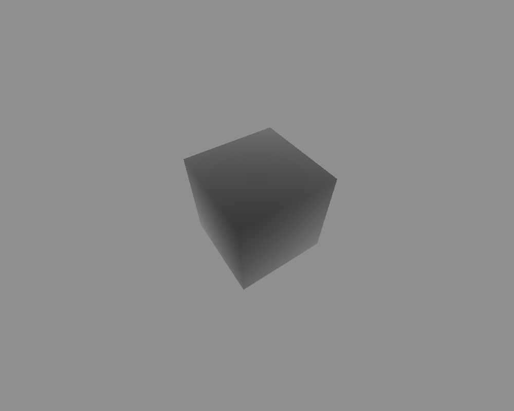
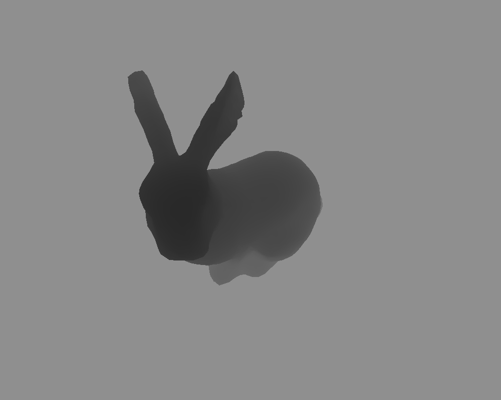
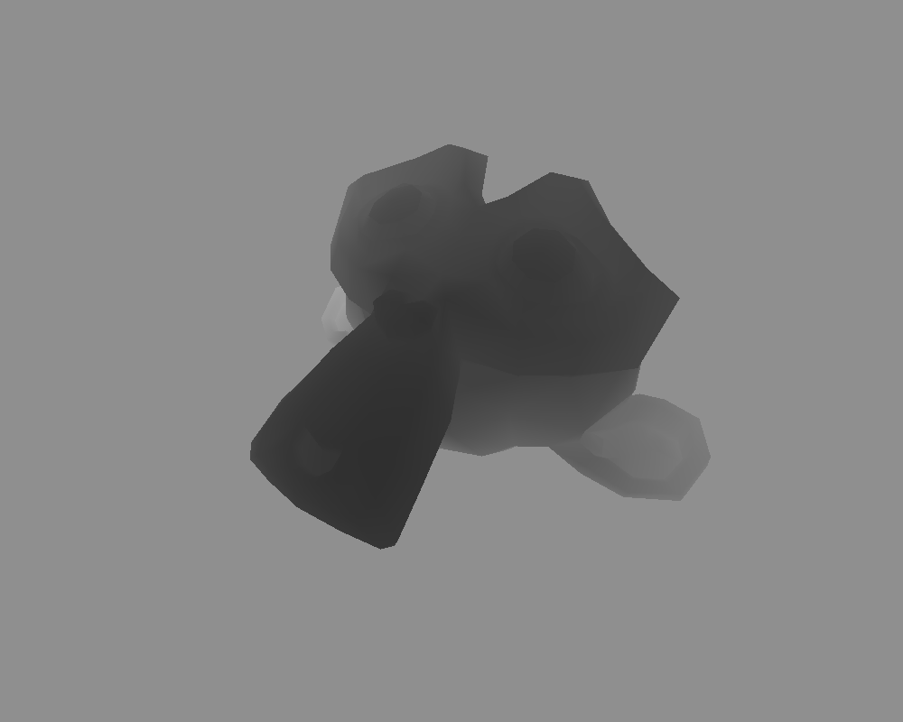
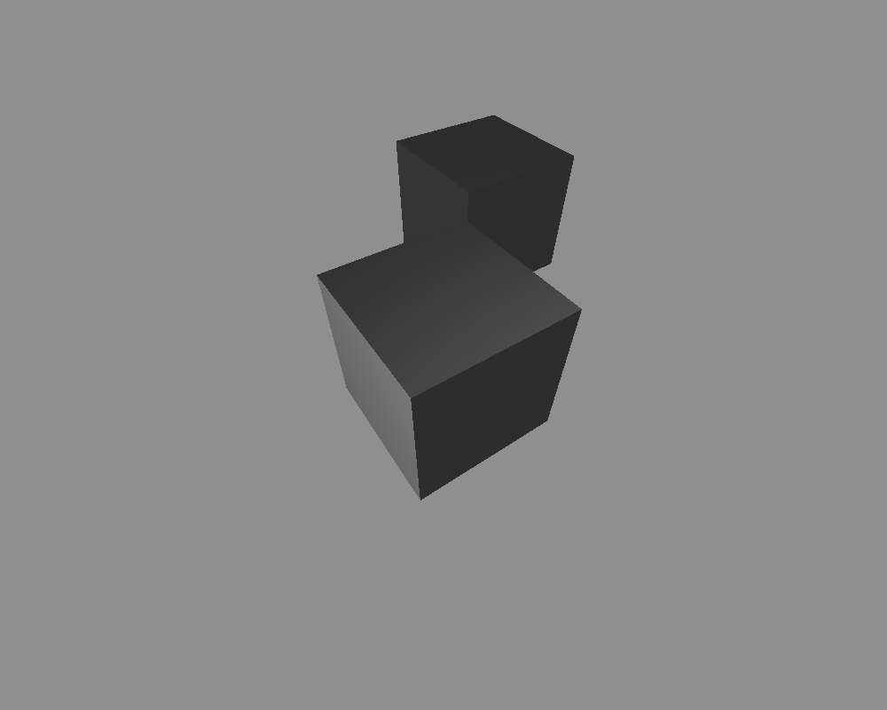
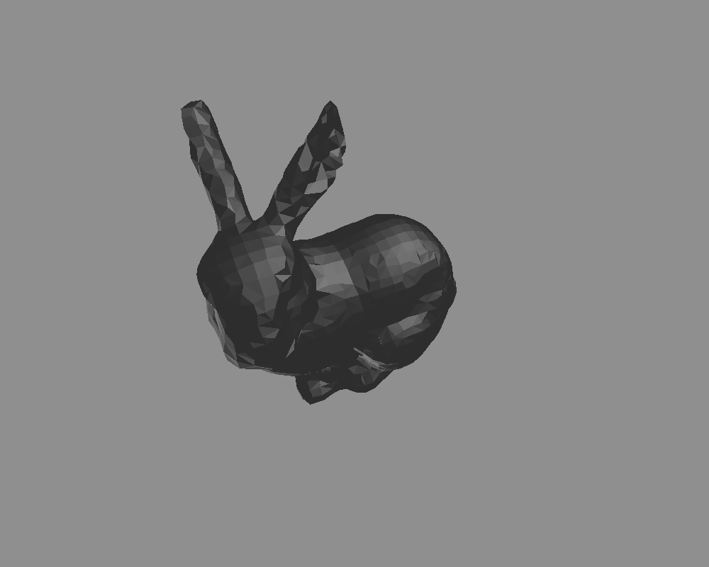
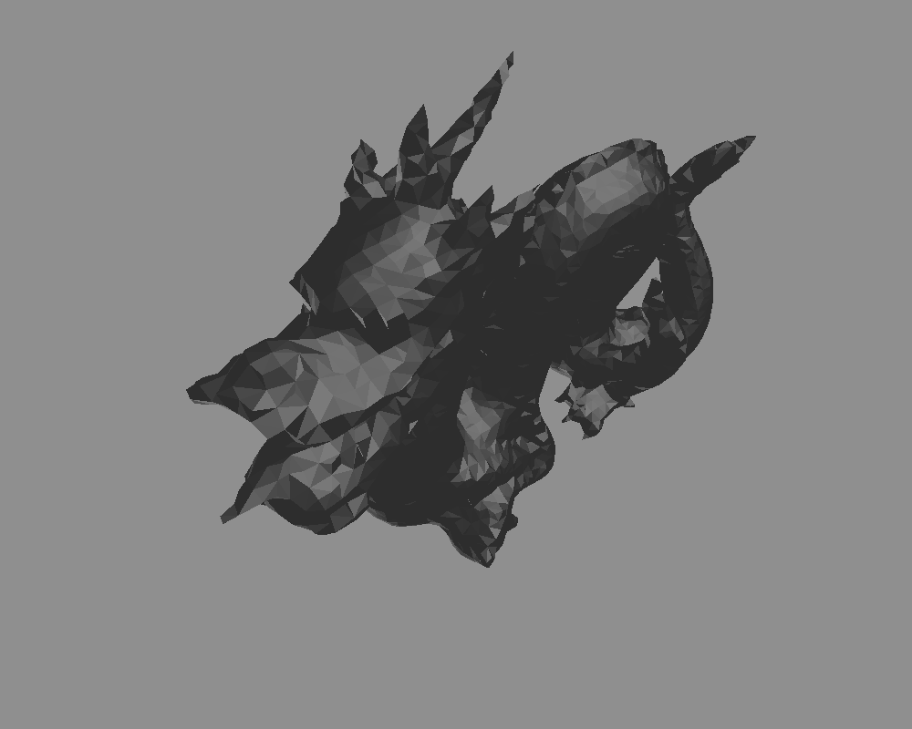
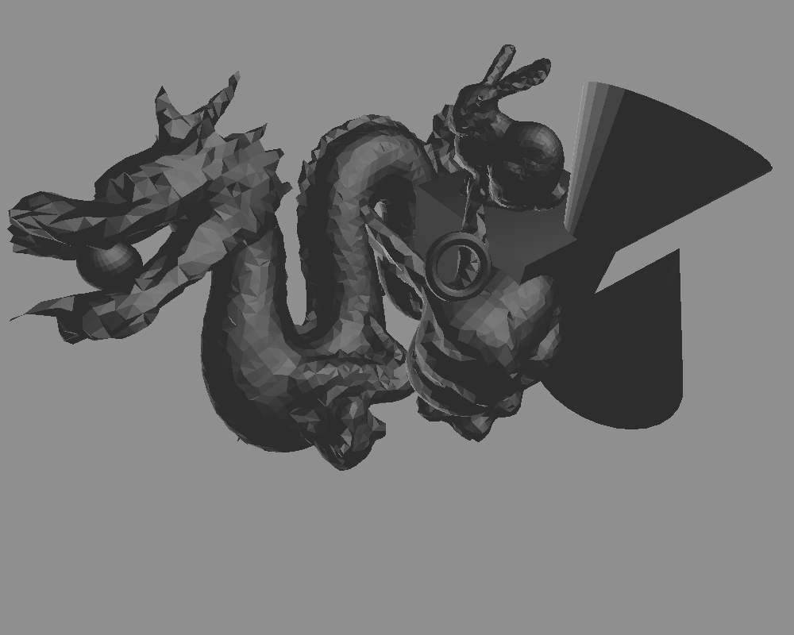

# View-3ds
view .3ds files based on z-buffering but without OpenGL

## Function
Read vertex and faces information of models from a .3ds file, render them based on z-buffering-alg. then generate grey-scale map with format .ppm or .png. The grey-scale contains depth information.

```
$ g++ main.cpp
$ ./a.out ./3ds_files/test00.3ds -o ./outputs/test00.png
$ display ./outputs/test00.png
```

## Dependency
 - [OpenGL Mathematics Library](https://glm.g-truc.net/0.9.8/index.html)
 - [Stanford 3D Scanning Repository](http://graphics.stanford.edu/data/3Dscanrep/)
 - [ImageMagick](http://www.imagemagick.org/script/index.php) for command `convert`


## Render Example

 
 


## Render based on Phong-Illumination-Model

Add code `#define PHONG` in file `main.hpp`.

 
 