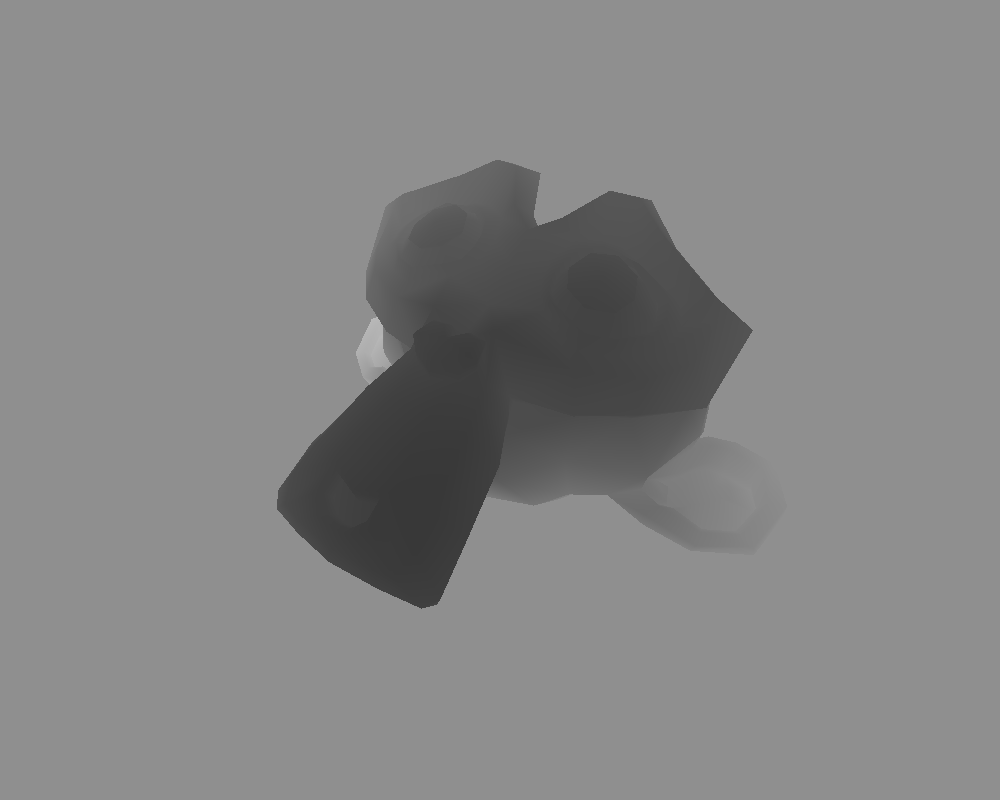
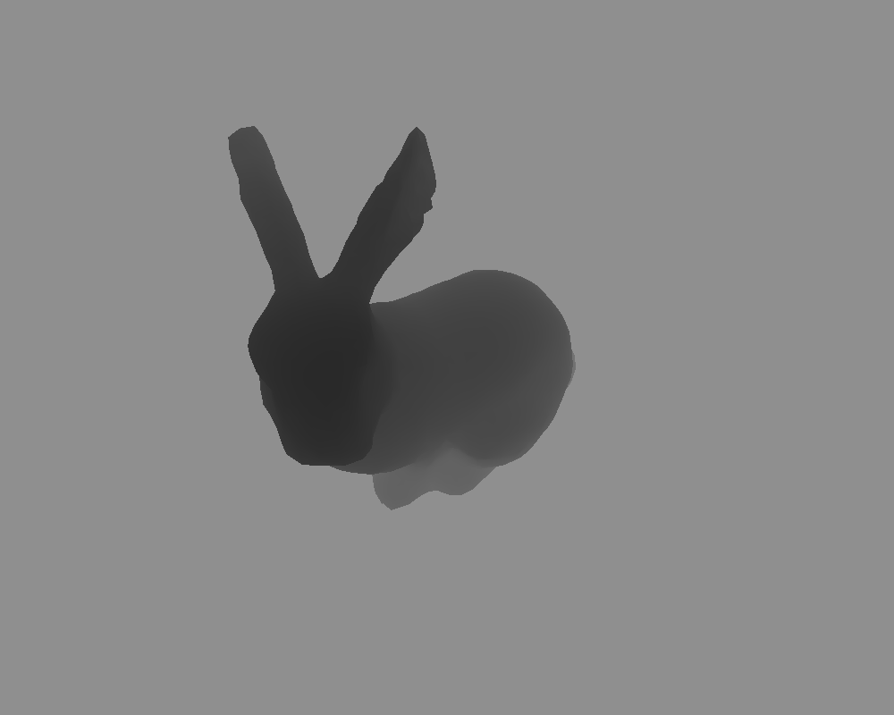
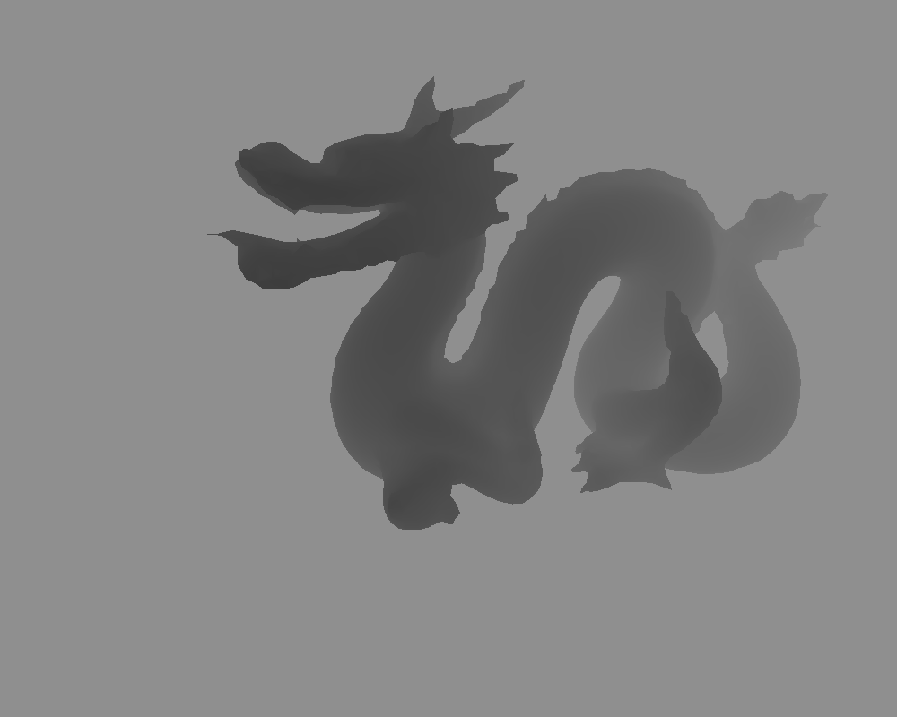
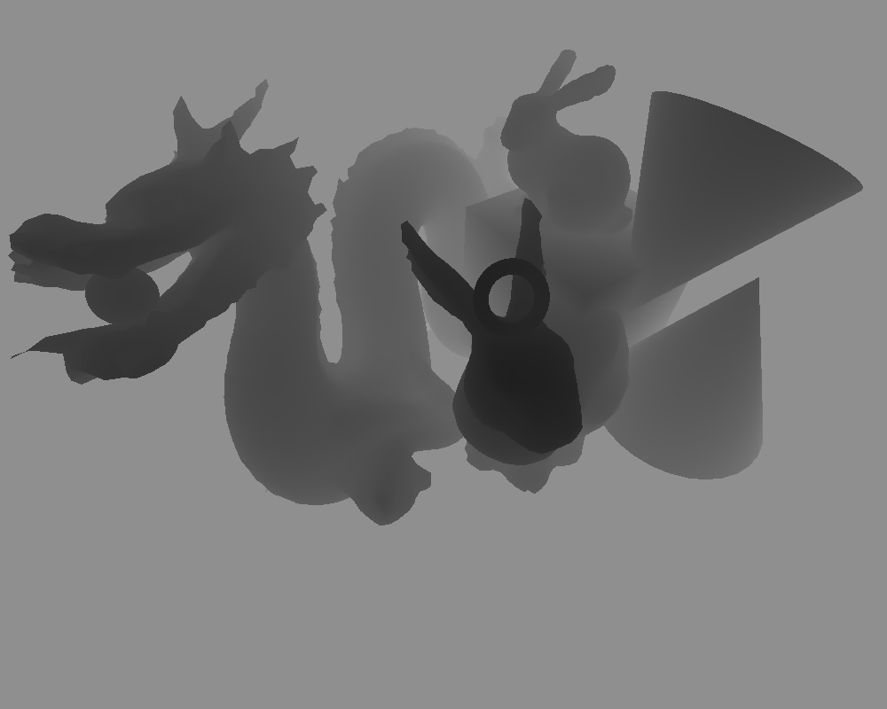

# View-3ds
view .3ds files based on z-buffering but without OpenGL

## Function
Read vertex and faces information of models from a .3ds file, render them based on z-buffering-alg. then generate grey-scale map with format .ppm or .png. The grey-scale contains depth information.

```
$ g++ main.cpp
$ ./a.out
$ cd outputs && bash conv.sh
```

## Dependency
 - [OpenGL Mathematics Library](https://glm.g-truc.net/0.9.8/index.html)
 - [Stanford 3D Scanning Repository](http://graphics.stanford.edu/data/3Dscanrep/)


## Render Example


  

  

<!--    -->


<!-- <div style="float:left;border:solid 2px 000;margin:2px;"></div> -->

<!-- <div style="float:left;border:solid 2px 000;margin:2px;"></div> -->

